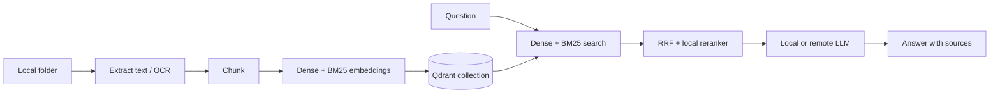

# Local RAG

A privacy-first command-line RAG system for your own files. Index a directory,
keep vectors in an isolated Qdrant database, and ask questions with a local
Ollama model or any OpenAI-compatible API.

## Features

- PDF text extraction with OCR fallback for scanned pages
- OCR for PNG, JPEG, WebP, TIFF, and BMP images
- DOCX, PPTX, HTML, Markdown, text, data files, and source code
- deterministic chunk IDs and safe re-indexing without duplicates
- hybrid dense + BM25 retrieval with Reciprocal Rank Fusion
- local ONNX cross-encoder reranking
- incremental folder sync using SHA-256 file hashes
- retrieval evaluation across dense, hybrid, and reranked profiles
- local Ollama embeddings and generation by default
- OpenAI-compatible remote endpoints when explicitly configured
- source and page/slide citations in every answer
- separate Qdrant collections for isolated knowledge bases

## Architecture



Documents are treated as untrusted context. The system prompt tells the model
not to execute instructions found inside retrieved files.

## Quick start: fully local

Requirements: Python 3.11+, Docker, [Ollama](https://ollama.com/), and
[Tesseract](https://tesseract-ocr.github.io/) only when OCR is needed.

```bash
git clone git@github.com:stailend/Local-RAG.git
cd Local-RAG
python3 -m venv .venv
source .venv/bin/activate
pip install .

docker compose up -d
ollama pull nomic-embed-text
ollama pull qwen2.5:7b

local-rag ingest ./knowledge
local-rag ask "What are the main conclusions?"
```

Inspect retrieval decisions without calling the chat model:

```bash
local-rag search "RentenNavi uptime" --explain
```

The command shows dense and sparse ranks, the fused RRF score, and the final
reranker score. Retrieval fetches 20 candidates and reranks the best 5 by
default. Tune or disable that stage when latency matters:

```bash
local-rag ask "Question" --candidates 30 --top-k 8
local-rag ask "Question" --no-rerank
```

The default reranker is the small English `ms-marco-TinyBERT-L-2-v2`. Set
`LOCAL_RAG_RERANK_MODEL=ms-marco-MultiBERT-L-12` for multilingual retrieval.
Models are downloaded once into `~/.cache/local-rag`.

## Incremental sync

Mirror a directory into a collection without embedding unchanged files:

```bash
local-rag sync ./knowledge
```

The command reports added, updated, deleted, unchanged, and skipped files.
Unlike `ingest`, it removes indexed files that no longer exist below the same
directory root. Each sync root is tracked independently inside the collection.

## Evaluation

Create a JSON dataset with expected source, locator, or text constraints:

```json
[
  {
    "question": "Where are emergency supplies stored?",
    "expected_source": "project.md",
    "expected_text": "locker 42"
  }
]
```

Then compare all retrieval profiles:

```bash
local-rag evaluate examples/evaluation.json
local-rag evaluate examples/evaluation.json --json
```

The report includes Recall@K, mean reciprocal rank, and median retrieval time
for dense, hybrid, and hybrid+reranker. Query embedding time is excluded so
the retrieval stages are compared fairly.

If Docker is unavailable, use Qdrant's persistent embedded mode instead:

```bash
local-rag --qdrant-url file://./.localrag/qdrant ingest ./knowledge
local-rag --qdrant-url file://./.localrag/qdrant ask "What are the conclusions?"
```

For a persistent conversation:

```bash
local-rag chat
```

## Remote or self-hosted OpenAI-compatible API

The same flags work with OpenAI, vLLM, LM Studio, LocalAI, and compatible
gateways. The embedding model must be served by the same endpoint.

```bash
export LOCAL_RAG_PROVIDER=openai-compatible
export LOCAL_RAG_BASE_URL=https://api.openai.com
export LOCAL_RAG_API_KEY=your-key
export LOCAL_RAG_CHAT_MODEL=gpt-4.1-mini
export LOCAL_RAG_EMBEDDING_MODEL=text-embedding-3-small

local-rag --collection work ingest ./knowledge
local-rag --collection work ask "Summarize the incident report"
```

Configuration can be provided by environment variables from `.env.example`
or by global CLI flags placed before the command:

```bash
local-rag --provider ollama --chat-model llama3.2 ask "Question"
```

## Knowledge-base isolation

Each collection is an independent knowledge base:

```bash
local-rag --collection legal ingest ./legal-documents
local-rag --collection research ingest ./papers
local-rag --collection legal ask "When can the agreement be terminated?"
```

Useful maintenance commands:

```bash
local-rag doctor
local-rag status
local-rag --collection old delete --yes
```

Re-ingesting a file replaces its existing chunks. Use `sync` instead when the
collection must exactly mirror a directory.

Collections created before hybrid search used a legacy single-vector schema.
Delete and re-ingest them once:

```bash
local-rag --collection documents delete --yes
local-rag --collection documents ingest ./knowledge
```

## Supported formats

PDF, PNG, JPEG, WebP, TIFF, BMP, DOCX, PPTX, HTML, TXT, Markdown, RST, CSV,
JSON, JSONL, YAML, TOML, XML, logs, and common source-code files.

OCR defaults to English. Install additional Tesseract language packs and set,
for example, `LOCAL_RAG_OCR_LANGUAGE=eng+deu+rus` for multilingual documents.

## Development

```bash
PYTHONPATH=src python -m unittest discover -s tests -v
```

## Privacy model

With the default Ollama provider, document text and questions stay on the local
machine. Qdrant persists vectors in the Docker volume `qdrant_data`. Selecting a
remote endpoint sends chunks and questions to that endpoint; do so only when its
data policy is acceptable.

## License

MIT
